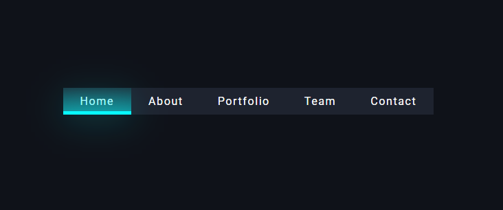

# 🧭 Nav Link Indicator

Un componente de navegación interactivo con un indicador visual animado que se mueve suavemente entre los enlaces seleccionados.

## ✨ Características

- **Indicador animado**: Se desplaza suavemente entre los enlaces al hacer clic
- **Diseño moderno**: Interfaz elegante con efectos de gradiente y sombras
- **Responsive**: Se adapta al ancho de cada enlace automáticamente
- **Fácil de personalizar**: CSS modular y JavaScript comentado

## 📸 Preview



<!-- Imagen temporal mientras creas la real -->
<!--  -->

<!-- Para mostrar una animación, también puedes usar un GIF -->
<!--  -->

_Captura de pantalla mostrando el indicador animado en acción_

## 🚀 Uso

1. **Clona o descarga** este repositorio
2. **Abre** `index.html` en tu navegador
3. **Haz clic** en los diferentes enlaces para ver la animación del indicador

## 📁 Estructura del proyecto

```
nav-link-indicator/
├── index.html      # Estructura HTML del componente
├── style.css       # Estilos y animaciones
├── index.js        # Lógica de movimiento del indicador
└── README.md       # Este archivo
```

## 🔧 Cómo funciona

### HTML

- Navegación con lista de enlaces
- Elemento `#indicator` que actúa como indicador visual

### CSS

- Posicionamiento absoluto para el indicador
- Transiciones suaves con `transition: all 0.5s ease`
- Efectos visuales con gradientes y sombras

### JavaScript

- Detecta clics en los enlaces de navegación
- Calcula la posición y ancho del enlace seleccionado
- Mueve el indicador a la posición correcta con animación CSS

## 🎨 Personalización

### Cambiar colores

Modifica las variables de color en `style.css`:

```css
/* Color del indicador */
border-bottom: 5px solid #08f9ff;
background: linear-gradient(0deg, rgba(8, 249, 255, 0.5), rgba(8, 249, 255, 0.1));

/* Color de fondo */
background-color: #0f1219;
```

### Ajustar velocidad de animación

Cambia la duración de la transición:

```css
#indicator {
	transition: all 0.5s ease; /* Cambia 0.5s por el tiempo deseado */
}
```

### Agregar más enlaces

Simplemente añade más elementos `<li><a>` en la lista:

```html
<li><a href="#services">Services</a></li>
<li><a href="#blog">Blog</a></li>
```

## 🛠️ Tecnologías utilizadas

- **HTML5**: Estructura semántica
- **CSS3**: Animaciones y estilos modernos
- **JavaScript ES6**: Lógica de interacción
- **Google Fonts**: Tipografía Roboto

## 📱 Compatibilidad

- ✅ Chrome (últimas versiones)
- ✅ Firefox (últimas versiones)
- ✅ Safari (últimas versiones)
- ✅ Edge (últimas versiones)

## 📄 Licencia

Este proyecto está bajo la Licencia MIT. Siéntete libre de usarlo en tus proyectos.

## 🤝 Contribuciones

Las contribuciones son bienvenidas. Por favor:

1. Haz fork del proyecto
2. Crea una rama para tu feature (`git checkout -b feature/AmazingFeature`)
3. Commit tus cambios (`git commit -m 'Add some AmazingFeature'`)
4. Push a la rama (`git push origin feature/AmazingFeature`)
5. Abre un Pull Request

---

⭐ Si te gusta este proyecto, ¡no olvides darle una estrella!
